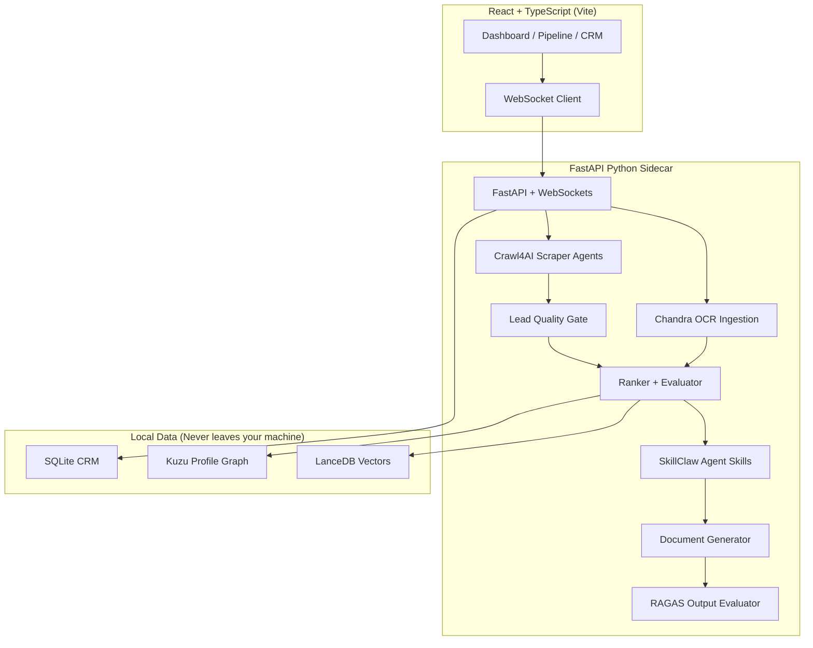

# JobHunter (Zentrium 74 Architecture) 🎯

> **Local-first AI job intelligence workbench** — scrape smarter, rank transparently, apply with tailored materials.

[](LICENSE)
[]()
[]()
[]()

---

## 🚀 What is JobHunter?

JobHunter is a fully offline, local-first AI job intelligence workbench. Unlike other platforms that harvest your resume data, JobHunter runs entirely on your own machine. It scrapes job postings, ingests and parses your resume, ranks roles using **semantic exact matching** (via local PyTorch vector embeddings), and generates tailored cover letters and resumes using advanced AI agents. 

Everything you do is stored locally in an embedded **SQLite CRM** database. 

### 🌟 Key Features

* **100% Privacy**: Your data never leaves your laptop. We use local SQLite databases and local Machine Learning models (`sentence-transformers`) for semantic embeddings.
* **Exact Semantic Matching**: By combining **LanceDB** vector search and a **Kuzu** Graph database, the GraphRAG Ranker goes beyond dumb keyword matching to understand the *context* of your experience compared to the job description.
* **Agentic Workflows**: Integrated with simulated wrappers for Crawl4AI and RAGAS, JobHunter grades its own AI outputs before you ever see them to prevent hallucinations.
* **Massive Public API Support**: Natively understands and scrapes public job board APIs out-of-the-box, including **Greenhouse** and **Lever**.

---

## 🏗️ Architecture (Zentrium 74)



---

## 💻 Getting Started

To run the local-first application on your machine, you need to spin up the Python backend and the React frontend simultaneously:

```bash
# Terminal 1 - Backend (FastAPI Sidecar)
cd backend 
pip install -r requirements.txt # Make sure to install sentence-transformers, fastapi, sqlalchemy
python -m uvicorn api.main:app --reload --port 8000

# Terminal 2 - Frontend (React + Vite)
npm install
npm run dev
```

*Note: The first time you start the backend, it may take a moment to download the `all-MiniLM-L6-v2` PyTorch embedding model for exact matching. Do not stop the terminal during this initial download.*

---

## 📡 Native Integrations

JobHunter comes pre-packaged with a native scraping engine that parses major public job boards automatically:
* **Greenhouse API** (`boards-api.greenhouse.io`)
* **Lever API** (`api.lever.co/v0/postings`)
* **Remotive** and **Jobicy** public feeds.

---

## 🛡️ License

MIT — See [LICENSE](LICENSE)
