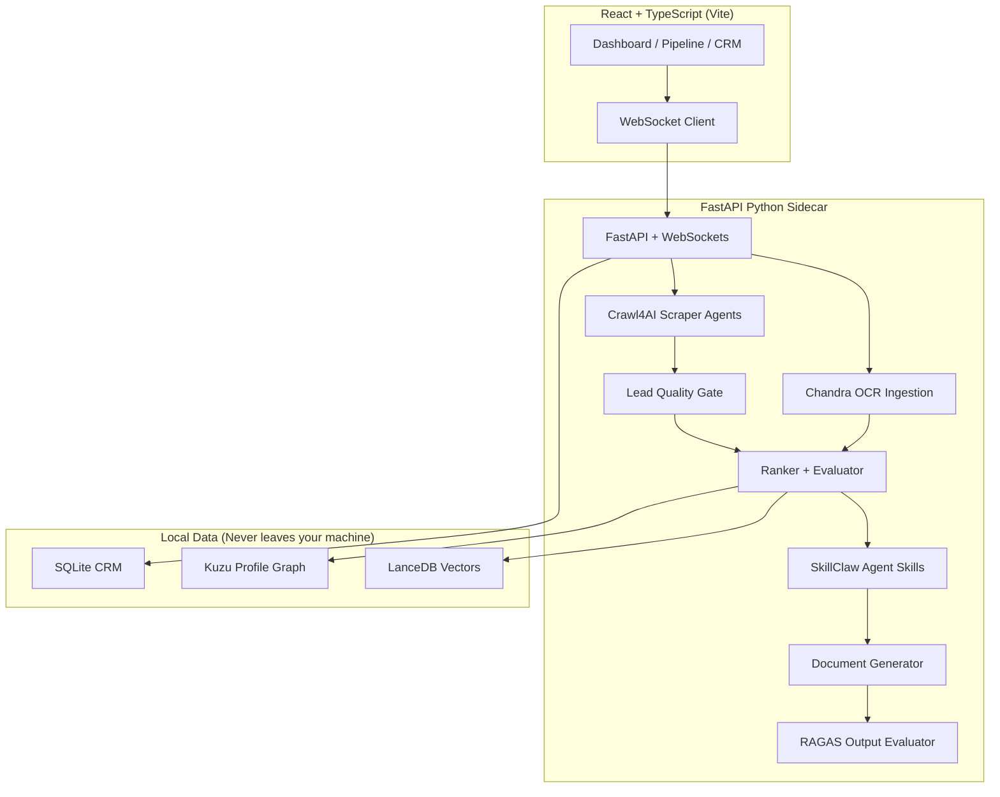

# JobHunter 🎯

> **Local-first AI job intelligence workbench** — scrape smarter, rank transparently, apply with tailored materials.

[](LICENSE)
[]()
[]()
[]()

---

## What is JobHunter

JobHunter is a local-first AI job intelligence workbench. It scrapes job postings, ingests and parses your resume/profile, ranks roles against your profile with transparent, explainable scoring, and generates tailored application materials such as resumes and cover letters. It combines a graph-based profile store, vector search for semantic matching, and an evaluation layer to check the quality of generated content, all running locally with pluggable LLM providers.

---

## Architecture



---

## Getting Started

```bash
# Terminal 1 - Backend
cd backend && uv run python -m uvicorn api.main:app --reload --port 8000

# Terminal 2 - Frontend
npm run dev
```

---

## Repository Structure

```text
JobHunter/
├── src/                    # React + TypeScript frontend
│   ├── api/                # HTTP + WebSocket clients
│   ├── features/           # Dashboard, Pipeline, Profile, CRM, Settings
│   ├── shared/             # Reusable components, hooks, utils
│   └── main.tsx
├── backend/                # Python FastAPI sidecar
│   ├── api/                # FastAPI app, routers, WebSockets
│   ├── ingestion/          # Chandra OCR resume ingestion
│   ├── scraping/           # Crawl4AI job scraper agents
│   ├── quality/            # Lead quality gate
│   ├── ranking/            # Fit scoring + semantic ranker
│   ├── skills/             # SkillClaw agentic skill evolver
│   ├── generation/         # Resume, cover letter, outreach generators
│   ├── evaluation/         # RAGAS output evaluator
│   ├── graph/              # Kuzu profile graph service
│   ├── vectors/            # LanceDB vector store
│   ├── llm/                # LLM provider abstraction
│   └── tests/
├── public/
├── .env.example
├── package.json
└── vite.config.ts
```

---

## Open Source Credits

| Project | Use in JobHunter | License |
|---|---|---|
| [Crawl4AI](https://github.com/unclecode/crawl4ai) | AI-native job scraping | Apache-2.0 |
| [Chandra OCR](https://github.com/datalab-to/chandra) | Resume ingestion | Apache-2.0 |
| [SkillClaw](https://github.com/AMAP-ML/SkillClaw) | Agentic skill evolution | MIT |
| [RAGAS](https://github.com/vibrantlabsai/ragas) | Output quality evaluation | Apache-2.0 |
| [LanceDB](https://github.com/lancedb/lancedb) | Vector storage | Apache-2.0 |
| [Kuzu](https://github.com/kuzudb/kuzu) | Profile graph DB | MIT |

---

## License

MIT — See [LICENSE](LICENSE)
